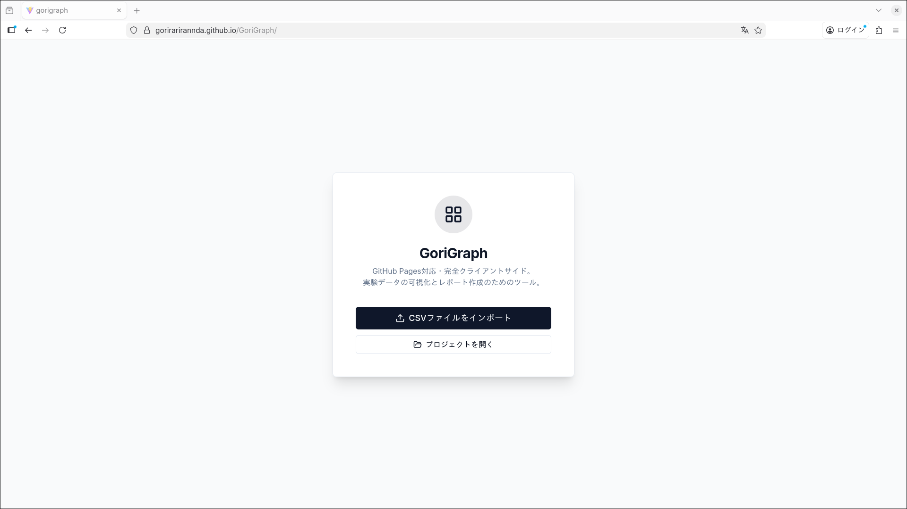
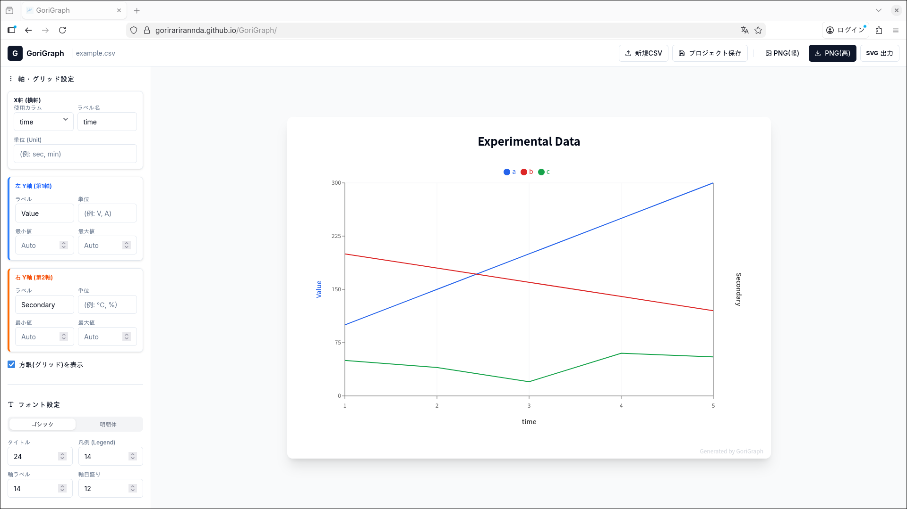

# GoriGraph

**GoriGraph** は、実験データやログデータ（CSV）を可視化し、論文やレポートに使用できる高品質なグラフ画像を生成するためのWebアプリケーションです。

サーバーサイド処理を行わず、すべてのデータ処理をブラウザ上で完結させるため、機密性の高い実験データでも安心して利用できます。

なおこのWEBアプリケーションはGemini3.0及びClaude Sonnet 4.5を使用して作成されました。

## ✨ 主な特徴

* **CSV インポート**: ドラッグ＆ドロップまたはファイル選択で即座にグラフ化。
* **2軸（左右Y軸）対応**: 電圧と電流、温度と湿度など、異なる単位のデータを1つのグラフで表現可能。
* **高度なグラフ設定**:
  * 軸ラベル、単位（`[V]`, `[℃]`など）の自動結合表示
  * 最小値・最大値の手動/自動設定
  * 線の太さ、ドット表示、グラフタイプ（折れ線/棒）の変更
  * 薄い方眼紙のようなグリッド表示（ON/OFF可）

* **高解像度エクスポート**: 論文や印刷に耐えうる高解像度（3倍スケール）でのPNG出力。
* **プロジェクト保存**: 設定したグラフの状態（色、軸設定など）をJSONファイルとして保存・復元可能。
* **完全クライアントサイド**: データは外部サーバーに送信されません。

## 🛠 技術スタック

* **Framework**: React (Vite)
* **Language**: TypeScript
* **Styling**: Tailwind CSS v4
* **Chart Library**: Recharts
* **CSV Parsing**: PapaParse
* **Image Generation**: html-to-image
* **Package Manager**: pnpm

## 📖 使い方

1. **データの準備**: ヘッダー行を含むCSVファイルを用意します。
2. **インポート**: 「CSVファイルをインポート」ボタンからファイルを読み込みます。
3. **設定**:

    1. 左サイドバーの「グラフ設定」タブで、X軸・Y軸の割り当て、ラベル、単位を設定します。
    2. 「データ系列」セクションで、各データの表示色や線の太さ、所属する軸（左/右）を調整します。

4. **編集**: 必要に応じて「データ編集」タブで数値を直接修正します。

5. **出力**: 右上の「画像出力」ボタンをクリックしてPNG画像をダウンロードします。
6. **保存**: 作業を中断する場合は「プロジェクト保存」でJSONファイルをダウンロードしておきます。

## 📄 ライセンス

このプロジェクトは [MIT License](https://www.google.com/search?q=LICENSE) の下で公開されています。

